# Univeristy Scheduler

| Student | Virghileanu Teodor |
| ------- | ------------------ |
| Group   | 30431              |

## Contents

- [Univeristy Scheduler](#univeristy-scheduler)
  - [Contents](#contents)
  - [Project specification](#project-specification)
  - [Domain model](#domain-model)
    - [Person Domain](#person-domain)
  - [Usecases](#usecases)
    - [University onboarding](#university-onboarding)
    - [User role assignation](#user-role-assignation)
    - [Assigning tasks](#assigning-tasks)
    - [Calendar check](#calendar-check)
  - [Users and stakeholers](#users-and-stakeholers)
  - [Architecture Design](#architecture-design)
    - [Non-functional requirements](#non-functional-requirements)
      - [Security](#security)
      - [Scalability](#scalability)
      - [Responsive design](#responsive-design)
      - [Performance and perceived quickness](#performance-and-perceived-quickness)
    - [Design constraints](#design-constraints)
    - [Database](#database)
    - [Sequence diagrams](#sequence-diagrams)
      - [User roles](#user-roles)
      - [User permission](#user-permission)
      - [Faculty & Course creation](#faculty--course-creation)
      - [Task creation](#task-creation)
      - [Calendar page](#calendar-page)
    - [Activity diagram](#activity-diagram)
      - [User roles and creation](#user-roles-and-creation)
      - [Package diagram](#package-diagram)
      - [Class diagram](#class-diagram)

## Project specification

The **University Scheduler** is a platform dedicated for **scheduling university related tasks and events** while also allowing **administrators** to manage its teachers, staff members and students. Of course, each actor can independently manage its own adequate resources.

The current delivery model envisioned is **Hosted Software**, not **SaaS**.

## Domain model

### Person Domain

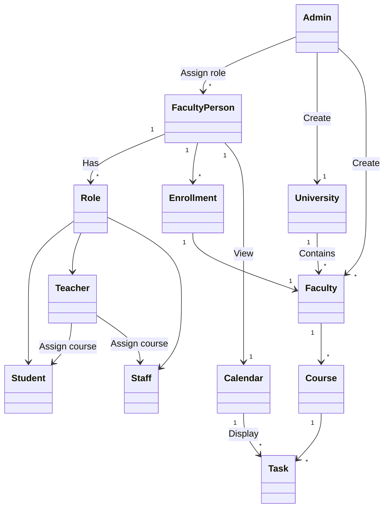

## Usecases

### University onboarding

| Level              | Main actor |
| ------------------ | ---------- |
| Administrator-Goal | Admin      |

This usecase is aimed for the **onboarding of the application** itsef. Before having users and managing resources, the administrator needs to **create** a **university**, its **faculties**, its **courses** and optionally have a yearly schedule set up. The latter step is optional because other users can be assigned to this task *(such as teachers with higher privileges)*.

**Success scenario:**

1. Admin accesses the panel.
2. He sees the application onboarding page, since the app is not yet set up.
3. He completes the forms sequentially.
4. He sets up the university details.
5. He creates empty faculties.
6. He creates empty courses.
7. He sets up Faculty-Course relations.
8. He optionally sets up the schedule for each course.

### User role assignation

| Level              | Main actor |
| ------------------ | ---------- |
| Administrator-Goal | Admin      |

This usecase covers **invitations** to the platform as well. Once an actor is invited, it also receives a platform invitation followed by a **mandatory profile onboarding**. Role assignation is important because functionality on the platform is permission driven. **Teacher**, **Student** and **Staff** are just permission presets.

**Success scenario:**

1. Admin accesses the panel and visits the user management page.
2. Admin invites a new user to the platform.
3. Admin assigns roles prior to the new user onboarding.
4. New user can do specific role workflows.

### Assigning tasks

| Level        | Main actor |
| ------------ | ---------- |
| Teacher-Goal | Teacher    |

Since permissions exist, the administrator **is not the only one** capable of creating and assigning tasks. Because of this, a different actor name will be used to describe the user which is able to create tasks.

**Success scenario:**

1. Teacher selects a course.
2. Teacher invites one of his Students to the selected course.

Every task of the course will now be visible for each student of the course.

### Calendar check

Viewing the calendar and inspecting tasks is the target of the application. This action is not targetted to any kind of actor specifically, every user has the base privileges to view the calendar.

**Success scenario:**

1. User accesses the calendar
2. User inspects the weekly view
3. Student cries

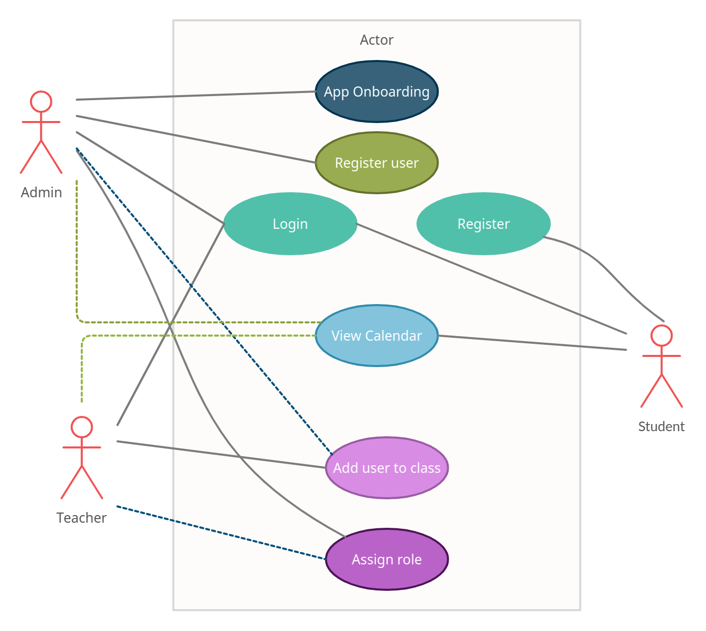

## Users and stakeholers

The stakeholders of this application are **university leading members**. They are the one who benefit from the platform and they can be positively or negatively affected by the business. They manage all resources on the platform.

As a consequence, the users of the application are **students**, whose presence on the platform is also optional.

## Architecture Design

The Design principle for this web app's backend is a `3 Layer Architecture`.

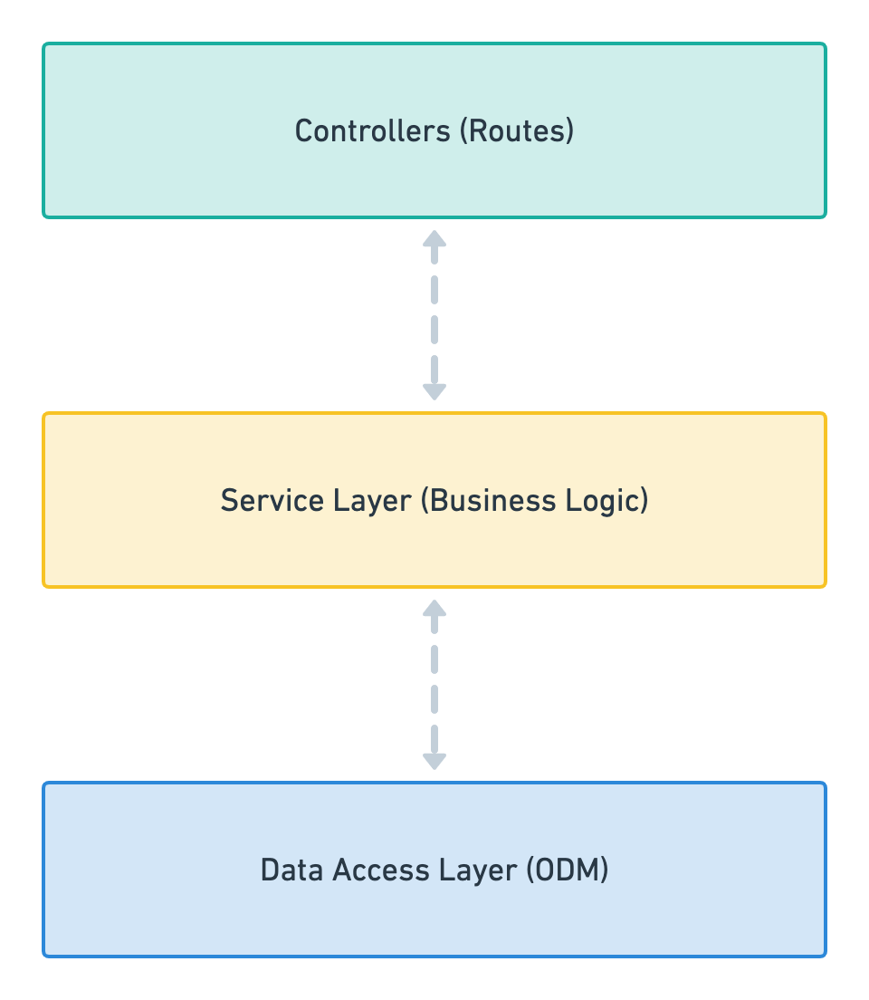

1. A controller’s sole purpose is to receive requests for the application and deal with routes.
2. The service layer should only include business logic. For example, all the CRUD operations and methods to determine how data can be created, stored and updated.
3. The data access layer takes care and provides logic to access data stored in persistent storage of some kind. For example an ODM like Mongoose, or ORM like TypeOrm

The framework of choise is [NestJS](https://nestjs.com/) ([docs](https://docs.nestjs.com/)) due to its **modularity** and **powerset of awesome features**.

The name is missleading, **typescript** will be used instead of plain **javascript**.

**Key features:**

- `ORM` via [TypeOrm](https://typeorm.io/)
- `Permissions` via [Casl](https://casl.js.org/v5/en/guide/intro)
- `JWT` and `local` auth strategies

### Non-functional requirements

#### Security

User credentials will be encrypted, and tokens will be signed with a `SECRET`.

The **JWT** token will encapsulate *non sensitive user data* and **permissions** which will later be used to reject **unauthorized requests**.

#### Scalability

This is a `non-problem` due to the way **NestJS** is build. Being modular allows for easy and flexible **scalability**.

#### Responsive design

A mobile-friendly responsive design is a must!

The frontend will be built using [SolidJS](https://www.solidjs.com/). The CSS frameworks of choice are [TailwindCSS](https://tailwindcss.com/) and [Unocss](https://github.com/unocss/unocss). Only one css engine will be used after one is picked to be used.

This will allow for a **quick** and **beautiful design**, built in a **mobile first breakpoint system**.

#### Performance and perceived quickness

Webpages will be served quickly, packed as minimal as possible, and all requests will be asyncronous, so the user can enjoy a fast and smooth experience.

### Design constraints

- Technical constraints will require the database `seeding` and `migrating` features, such that the database is kept up to date and be populated with initial data before the **application onboarding**.
- A hash function is needed to encrypt user credentials.
- A UI library needs to be built before starting to implement the application design.

### Database

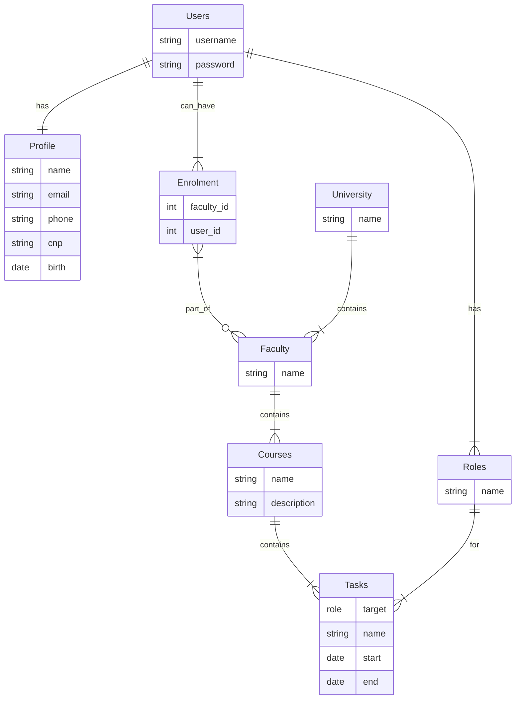

### Sequence diagrams

The sequence diagrams exemplify the sequence of events to consider in a normal workflow for several use cases.

#### User roles

This usecase covers **invitations** to the platform as well. Once an actor is invited, it also receives a platform invitation followed by a **mandatory profile onboarding**.

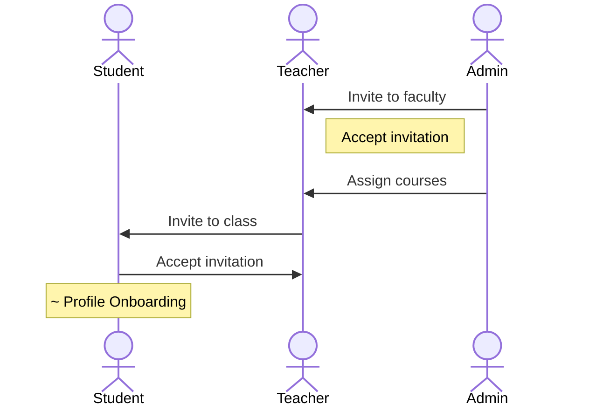

From now on, users can use the platform independently of each other.

#### User permission

Some **teachers** can have *different permissions* on the platform. For example, a teacher can be an **administrator** given the right permissions.

The same goes for **Staff members**.

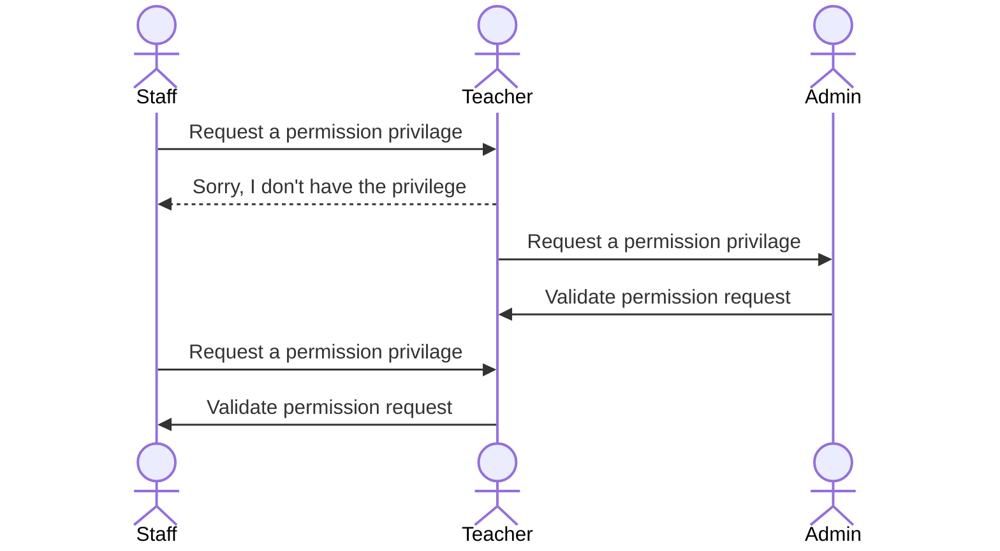

Each actor can independently assign permissions to other actors if they have the required priviledges.

#### Faculty & Course creation

This usecase covers the **admin** creating a **faculty** for a university and assigning **courses** to it. Currently, courses **are not independent** of faculties, since we don't cover the case in which a teacher has activity across *multiple universities*. Each course is unique to a faculty.

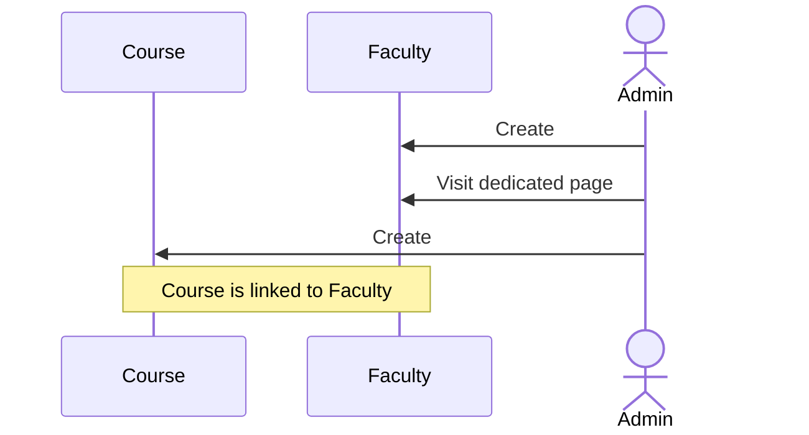

#### Task creation

Since permissions exist, the administrator **is not the only one** capable of creating and assigning tasks. Because of this, a different actor name will be used to describe the user which is able to create tasks.

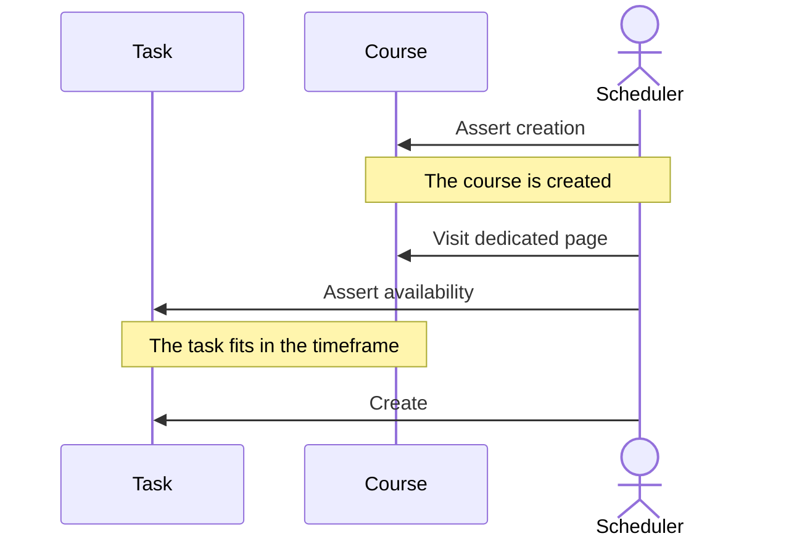

#### Calendar page

Viewing the calendar and inspecting individual elements is trivial.

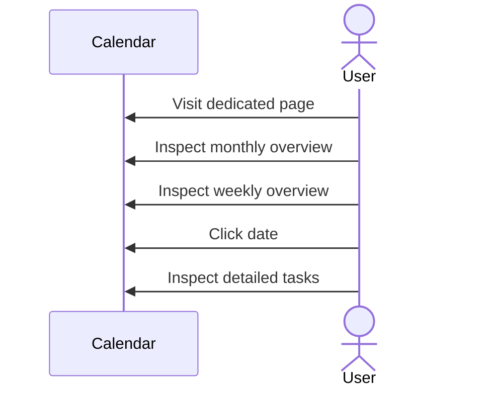

### Activity diagram

This diagram further illustrated the logic behind several usecases and sequence diagrams.

#### User roles and creation

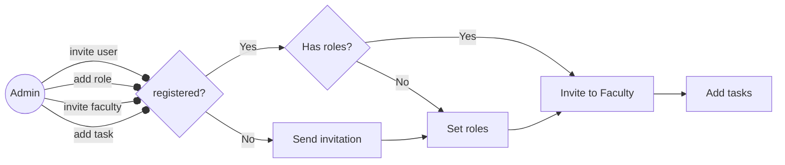

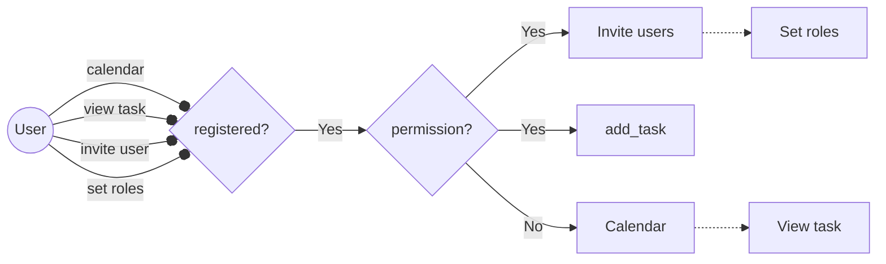

#### Package diagram

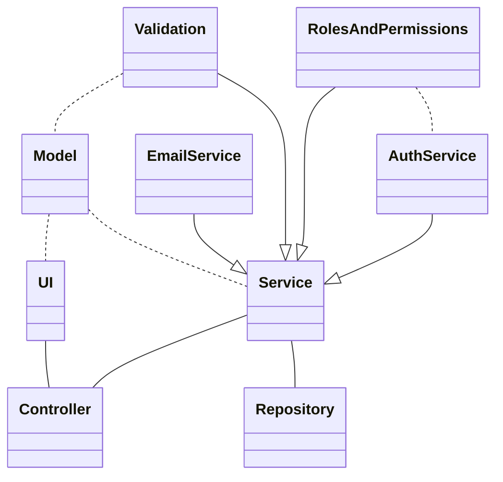

#### Class diagram

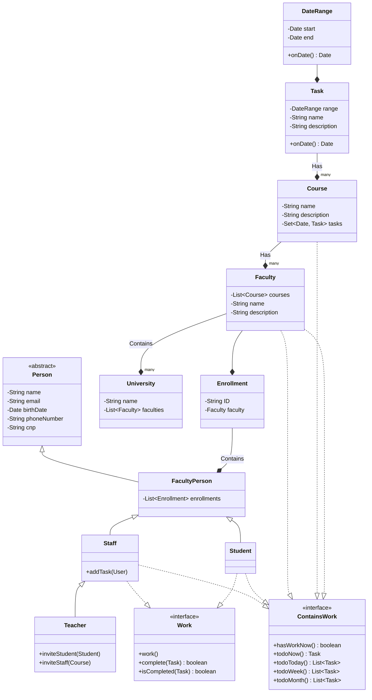
