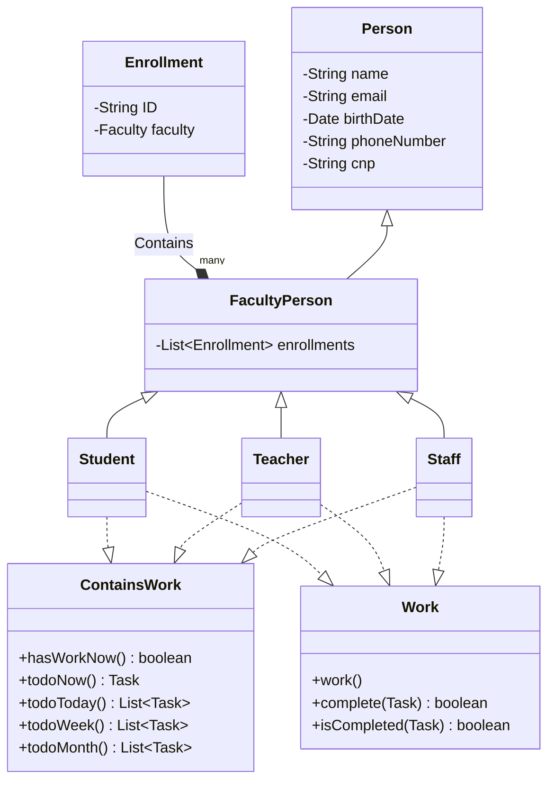
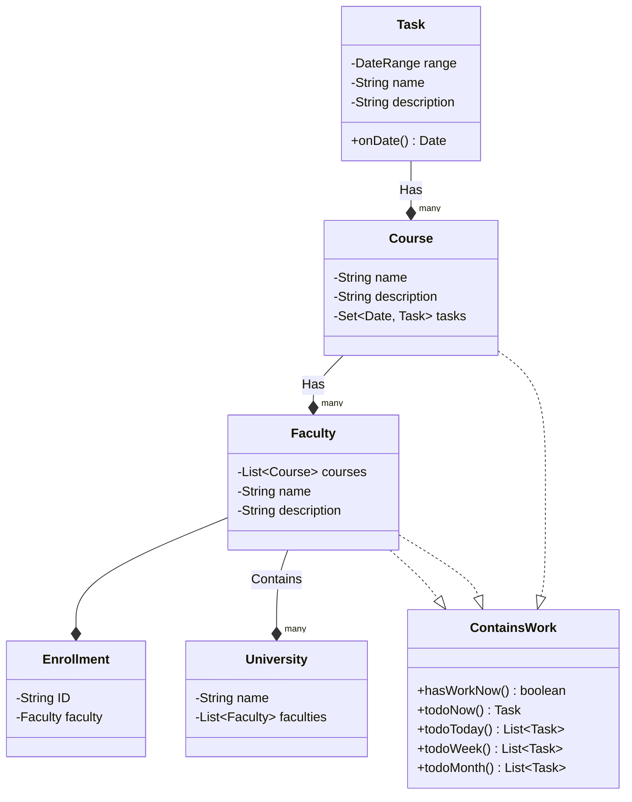
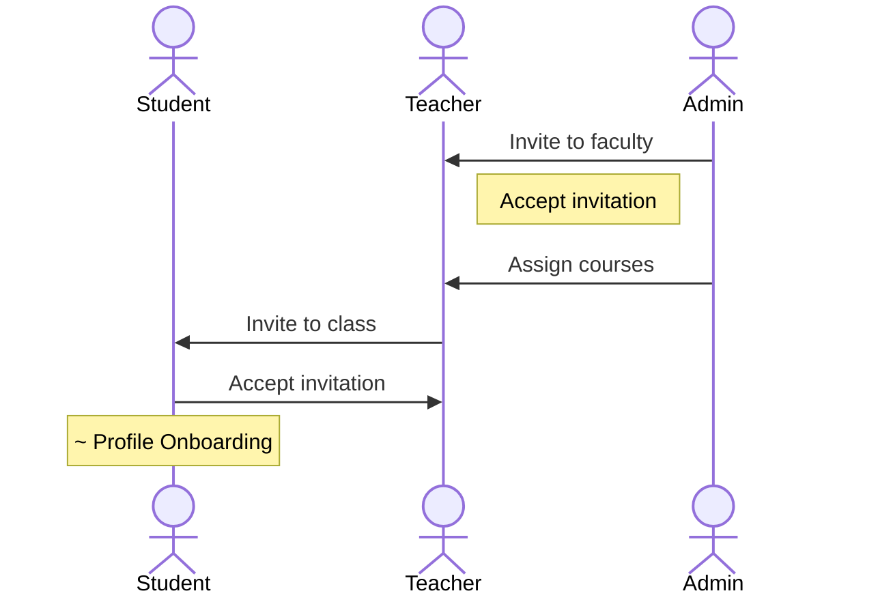
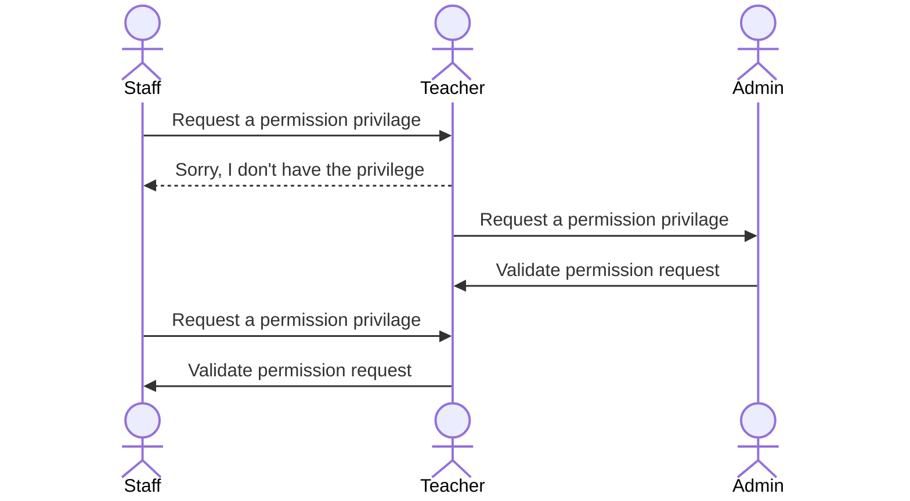
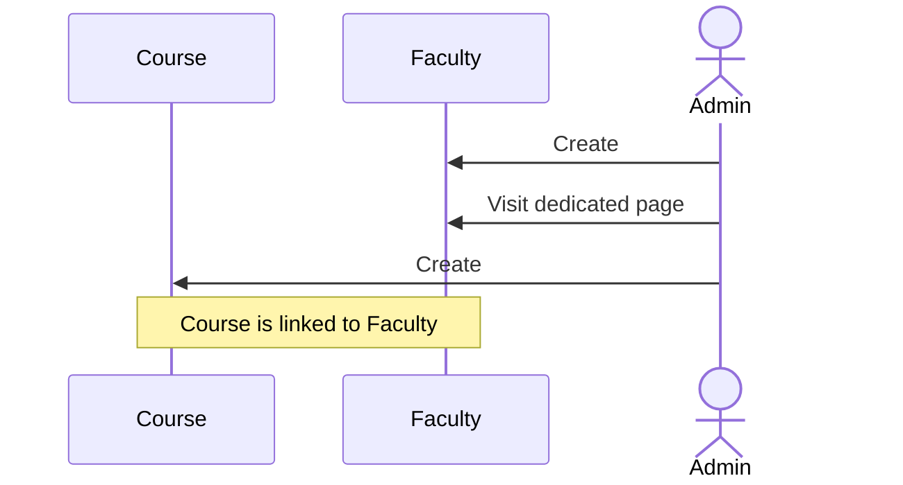
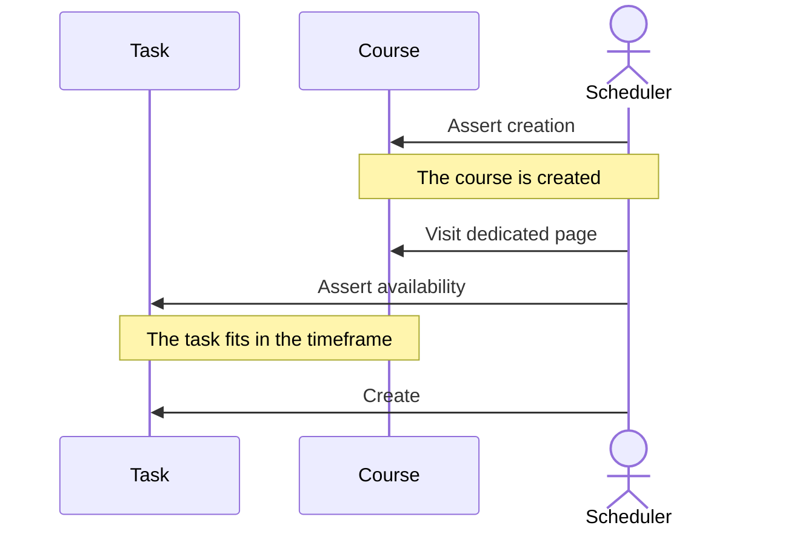
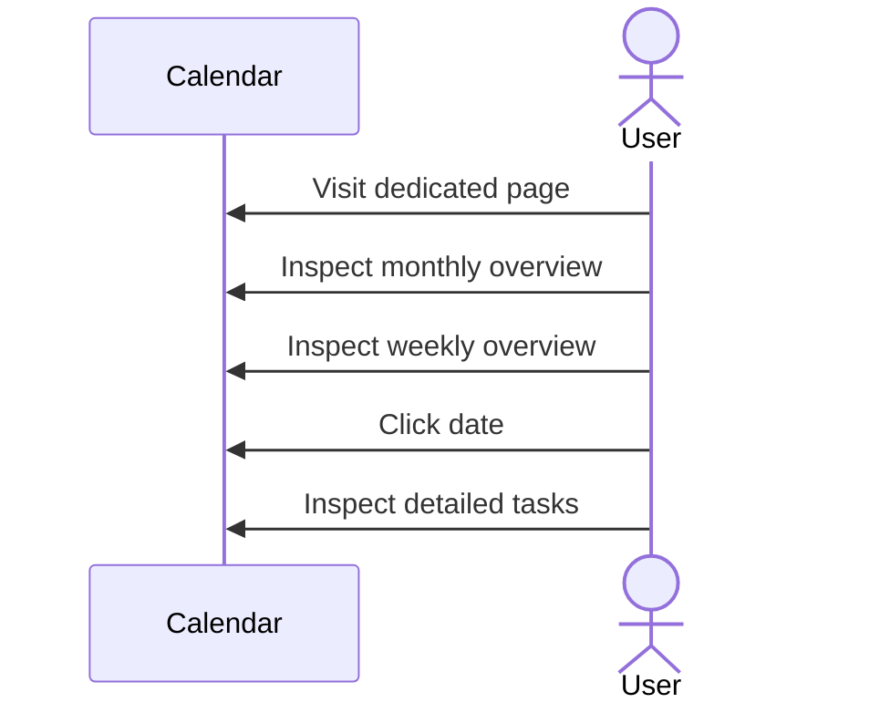

# Univeristy Scheduler

| Student | Virghileanu Teodor |
| ------- | ------------------ |
| Group   | 30431              |

## Contents

- [Univeristy Scheduler](#univeristy-scheduler)
  - [Contents](#contents)
  - [Project specification](#project-specification)
  - [Domain model](#domain-model)
    - [Person Domain](#person-domain)
    - [University Domain](#university-domain)
  - [Usecase Model](#usecase-model)
    - [User role assignation](#user-role-assignation)
    - [User permission](#user-permission)
    - [Faculty & Course creation](#faculty--course-creation)
    - [Assigning tasks](#assigning-tasks)
    - [Calendar check](#calendar-check)
  - [Users and stakeholers](#users-and-stakeholers)

## Project specification

The **University Scheduler** is a platform dedicated for **scheduling university related tasks and events** while also allowing **administrators** to manage its teachers, staff members and students. Of course, each actor can independently manage its own adequate resources.

The current delivery model envisioned is **Hosted Software**, not **SaaS**.

## Domain model

### Person Domain

### University Domain

## Usecase Model

### User role assignation

This usecase covers **invitations** to the platform as well. Once an actor is invited, it also receives a platform invitation followed by a **mandatory profile onboarding**.

From now on, users can use the platform independently of each other.

### User permission

Some **teachers** can have *different permissions* on the platform. For example, a teacher can be an **administrator** given the right permissions.

The same goes for **Staff members**.

Each actor can independently assign permissions to other actors if they have the required priviledges.

### Faculty & Course creation

This usecase covers the **admin** creating a **faculty** for a university and assigning **courses** to it. Currently, courses **are not independent** of faculties, since we don't cover the case in which a teacher has activity across *multiple universities*. Each course is unique to a faculty.

### Assigning tasks

Since permissions exist, the administrator **is not the only one** capable of creating and assigning tasks. Because of this, a different actor name will be used to describe the user which is able to create tasks.

### Calendar check

Viewing the calendar and inspecting individual elements is trivial.

## Users and stakeholers

The stakeholders of this application are **university leading members**. They are the one who benefit from the platform and they can be positively or negatively affected by the business.

As a consequence, the users of the application are **students**, whose presence on the platform is optional.
