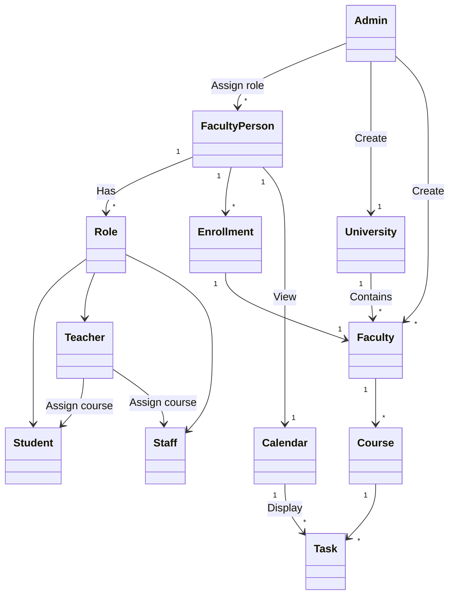
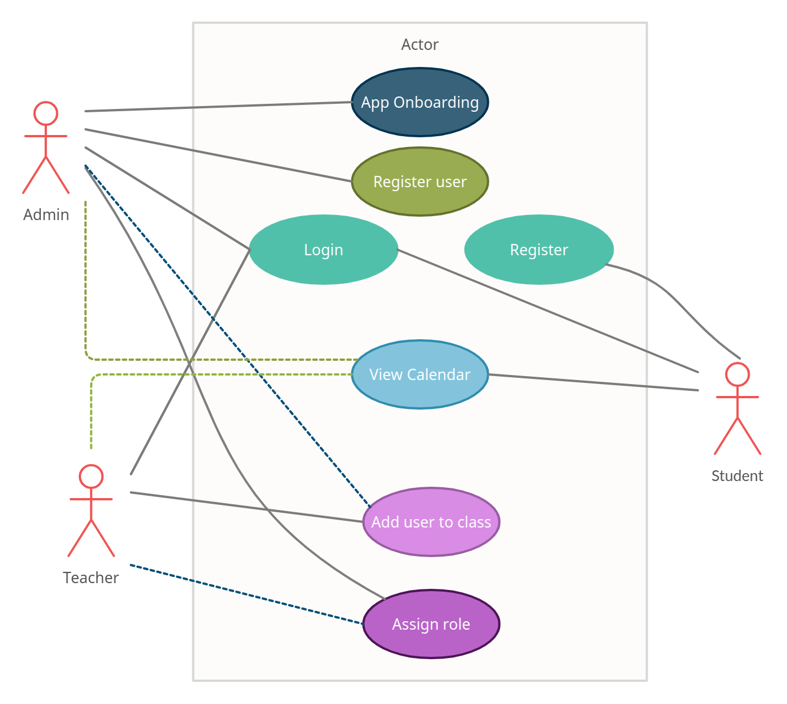

# Univeristy Scheduler

| Student | Virghileanu Teodor |
| ------- | ------------------ |
| Group   | 30431              |

## Contents

- [Univeristy Scheduler](#univeristy-scheduler)
  - [Contents](#contents)
  - [Project specification](#project-specification)
  - [Domain model](#domain-model)
    - [Person Domain](#person-domain)
  - [Usecases](#usecases)
    - [University onboarding](#university-onboarding)
    - [User role assignation](#user-role-assignation)
    - [Assigning tasks](#assigning-tasks)
    - [Calendar check](#calendar-check)
  - [Users and stakeholers](#users-and-stakeholers)

## Project specification

The **University Scheduler** is a platform dedicated for **scheduling university related tasks and events** while also allowing **administrators** to manage its teachers, staff members and students. Of course, each actor can independently manage its own adequate resources.

The current delivery model envisioned is **Hosted Software**, not **SaaS**.

## Domain model

### Person Domain

## Usecases

### University onboarding

| Level              | Main actor |
| ------------------ | ---------- |
| Administrator-Goal | Admin      |

This usecase is aimed for the **onboarding of the application** itsef. Before having users and managing resources, the administrator needs to **create** a **university**, its **faculties**, its **courses** and optionally have a yearly schedule set up. The latter step is optional because other users can be assigned to this task *(such as teachers with higher privileges)*.

**Success scenario:**

1. Admin accesses the panel.
2. He sees the application onboarding page, since the app is not yet set up.
3. He completes the forms sequentially.
4. He sets up the university details.
5. He creates empty faculties.
6. He creates empty courses.
7. He sets up Faculty-Course relations.
8. He optionally sets up the schedule for each course.

### User role assignation

| Level              | Main actor |
| ------------------ | ---------- |
| Administrator-Goal | Admin      |

This usecase covers **invitations** to the platform as well. Once an actor is invited, it also receives a platform invitation followed by a **mandatory profile onboarding**. Role assignation is important because functionality on the platform is permission driven. **Teacher**, **Student** and **Staff** are just permission presets.

**Success scenario:**

1. Admin accesses the panel and visits the user management page.
2. Admin invites a new user to the platform.
3. Admin assigns roles prior to the new user onboarding.
4. New user can do specific role workflows.

### Assigning tasks

| Level        | Main actor |
| ------------ | ---------- |
| Teacher-Goal | Teacher    |

Since permissions exist, the administrator **is not the only one** capable of creating and assigning tasks. Because of this, a different actor name will be used to describe the user which is able to create tasks.

**Success scenario:**

1. Teacher selects a course.
2. Teacher invites one of his Students to the selected course.

Every task of the course will now be visible for each student of the course.

### Calendar check

Viewing the calendar and inspecting tasks is the target of the application. This action is not targetted to any kind of actor specifically, every user has the base privileges to view the calendar.

**Success scenario:**

1. User accesses the calendar
2. User inspects the weekly view
3. Student cries

## Users and stakeholers

The stakeholders of this application are **university leading members**. They are the one who benefit from the platform and they can be positively or negatively affected by the business. They manage all resources on the platform.

As a consequence, the users of the application are **students**, whose presence on the platform is also optional.
